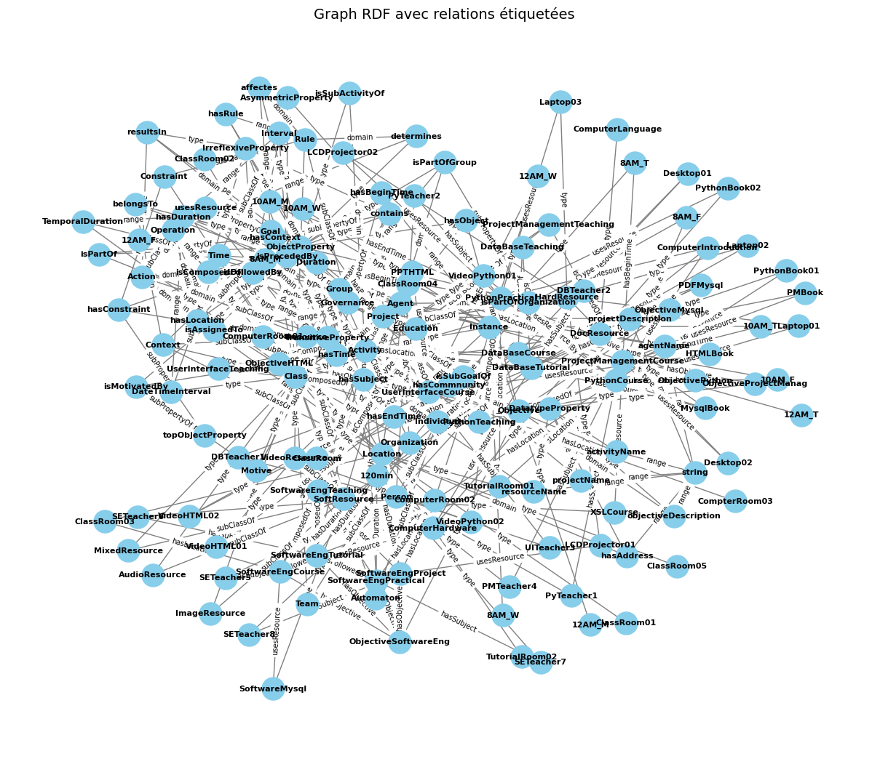

#  Semantic Similarity Analyzer for RDF Graphs

This project implements a semantic similarity framework to detect equivalences between RDF resources using ontological reasoning, graph embeddings (Node2Vec), and lexical similarity, focus on  knowledge graph alignment by processing RDF data, computing node embeddings, and providing a modular and scalable framework for entity resolution, ontology alignment, and knowledge graph integration.

---

##  Features

-  **Conceptual Similarity** via ontology class hierarchies
-  **Graph Embedding Similarity** using Node2Vec
-  **Lexical Similarity** using fuzzy string matching
-  **Automatic fusion of similar entities via `owl:sameAs`
-  **2D visualization** of learned embeddings using t-SNE
-  **Graph visualization** with labeled RDF relations
-  **MRR (Mean Reciprocal Rank)** evaluation of filtered results

---

##  Project Structure

| File | Description |
|------|-------------|
| `Fusion.ipynb` | Main executable with all logic (graph construction, similarity, visualization) |
| `*.ttl` | RDF ontology files in Turtle format |
| `result.ttl` | Output RDF file with `owl:sameAs` fusions |
| `requirements.txt` | Dependencies to install |

---

##  How It Works

1. **RDF Parsing**: Loads your `.ttl` file and constructs graphs of concepts and instances.
2. **Graph Construction**:
   - Builds `Graph3` (concept-instance)
   - Builds `Graph4` (full semantic RDF graph)
3. **Similarity Analysis**:
   - For each pair of related entities:
     - Computes concept similarity via class hierarchy
     - Computes vector similarity via Node2Vec
     - Computes name similarity via Levenshtein
     - Combines these to calculate a final similarity score
4. **Fusion**:
   - Adds `owl:sameAs` between similar entities
   - Saves enriched RDF in `result.ttl`
5. **Evaluation**:
   - Computes MRR on filtered predictions
6. **Visualization**:
   - Embeddings visualized in 2D (t-SNE)
   - RDF graph plotted with labeled edges

---

##  Evaluation (MRR)

After similarity computation, the script filters meaningful pairs and computes Mean Reciprocal Rank to evaluate ranking quality.

##  Installation

Required packages:

`rdflib`
`networkx`
`node2vec`
`fuzzywuzzy`
`scikit-learn`
`matplotlib`
`pandas`

##  Customization

- Change the weights in finalSimilarity = 0.75 * concept_sim + 0.25 * embedding_sim
- Swap out Node2Vec with GraphSAGE or GCN
- Add more RDF predicates in filtering logic

##  RDF Graph Visualization

This figure shows the semantic graph extracted from the ontology, with nodes representing classes and instances, and edges labeled with RDF properties.
